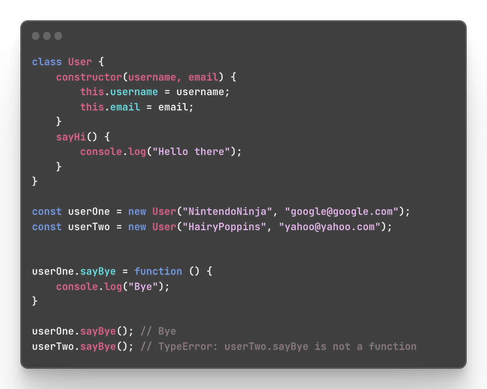
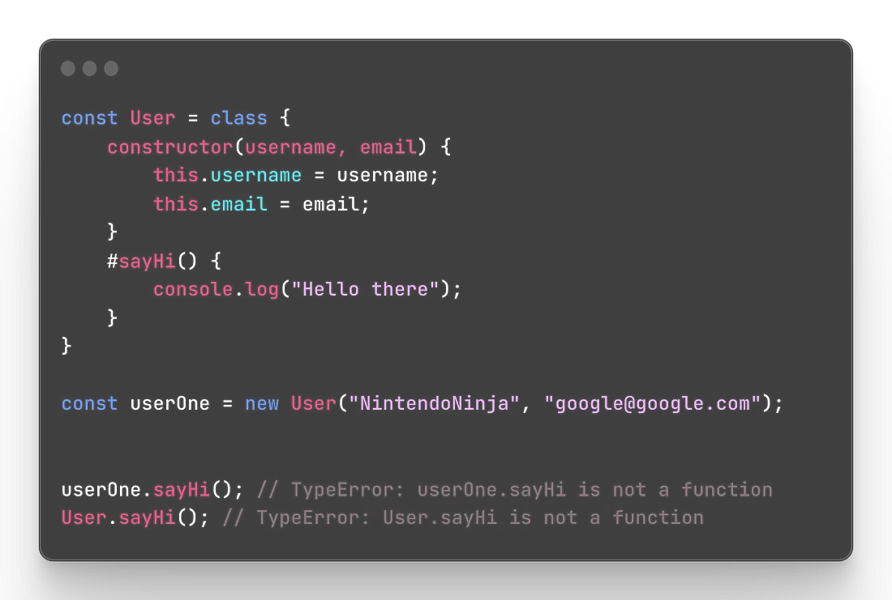
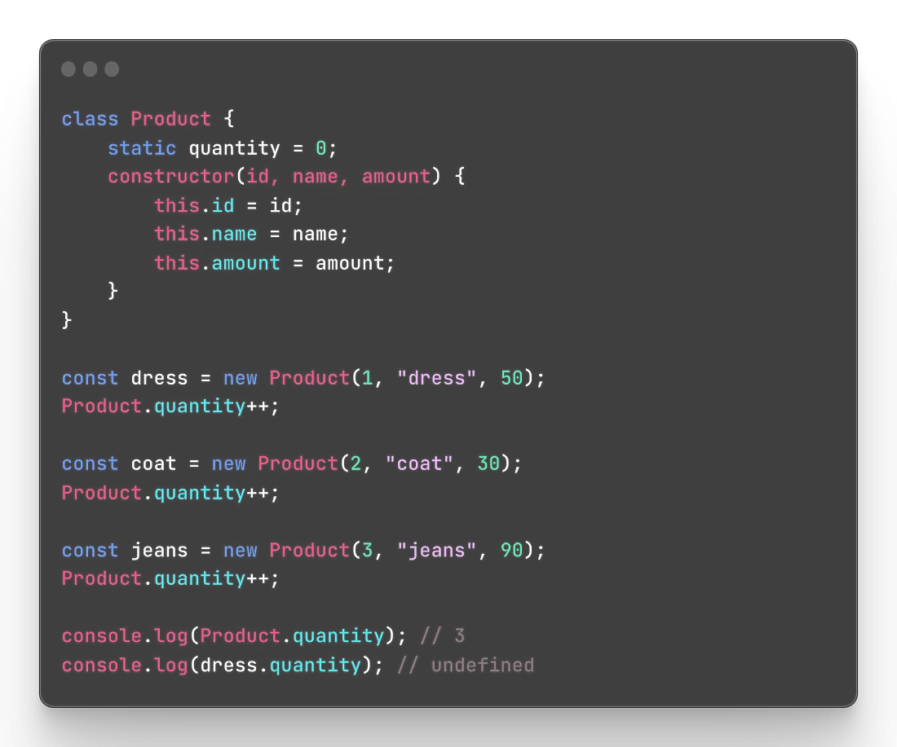
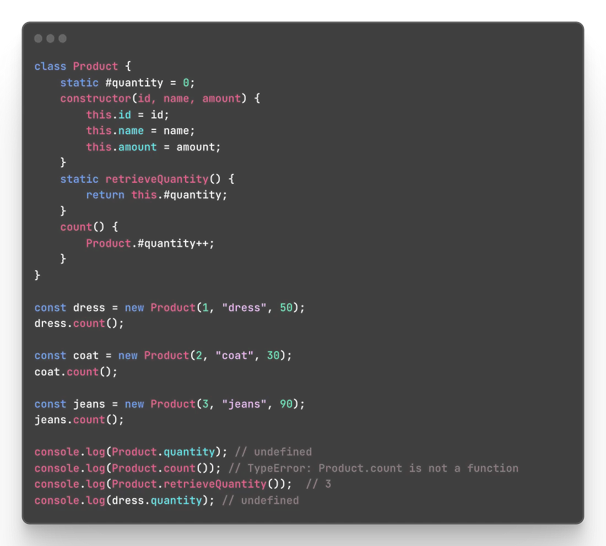
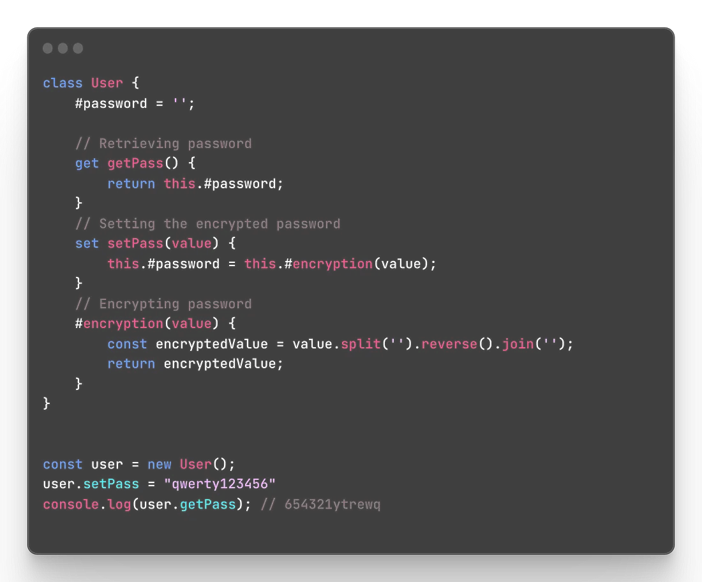
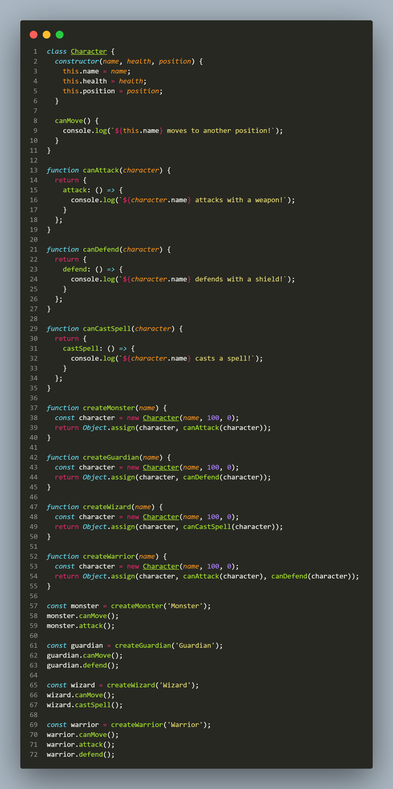

(INSTANCE METHODS)
create a method for one instance it does work but it will not be shared across other users and it’s not something we need.

(PRIVATE METHODS)

(STATIC INSTANCE)

(PRIVATE STATIC INSTANCE)

  

